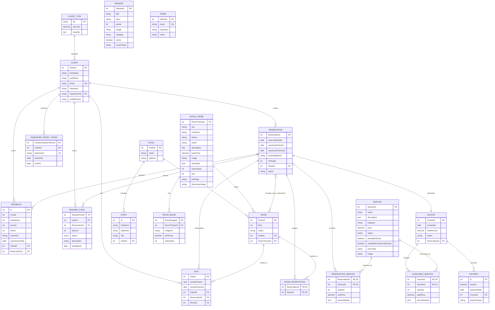

# Cityscape Hotel - Database Schema

This document summarizes the Sequelize database structure used by the Cityscape Hotel application.

The database is moderately complex because it covers the full hotel flow: clients, room themes, rooms, reservations, invoices, payments, services, feedback, stays, staff, rewards, and authentication helpers.

## Entity Relationship Diagram

## Main Tables And Purpose

| Table | Purpose |
| --- | --- |
| `Clients` | Stores guest accounts and profile data. |
| `ClientTypes` | Stores client tier/type information, discounts, and benefits. |
| `Hotels` | Stores hotel properties. Current app usually works with one hotel. |
| `Rooms` | Stores physical rooms, floor, status, hotel, and assigned theme. |
| `RoomThemes` | Stores the themed room concepts: city, style/name, base price, amenities, capacity, and images. |
| `RoomImages` | Stores gallery images for each room theme. |
| `Reservations` | Stores booking requests and reservation lifecycle status. |
| `RoomReservations` | Junction table between reservations and rooms. Allows a reservation to include one or more rooms. |
| `Invoices` | Stores the invoice generated for a reservation. |
| `Payments` | Stores actual money paid against invoices. This is the source for paid revenue. |
| `Services` | Stores extra services such as spa, experiences, breakfast, etc. |
| `ReservationServices` | Stores services selected during reservation, including quantity and unit price at selection time. |
| `ConsumedServices` | Stores services charged to an invoice after consumption/payment. |
| `Feedbacks` | Stores post-stay ratings and comments from clients. |
| `Stays` | Stores actual check-in/check-out records, linked to reservation, room, and client. |
| `Staffs` | Stores hotel staff records. |
| `Rewards` | Stores redeemable rewards in the rewards catalog. |
| `RewardPoints` | Stores points earned/redeemed by clients, optionally linked to reservations. |
| `PasswordResetTokens` | Stores hashed password reset tokens. |
| `Admins` | Stores admin login accounts. |

## Relationship Summary

| Relationship | Cardinality | Notes |
| --- | --- | --- |
| `ClientType` -> `Client` | 1:N | A client belongs to one type/tier. |
| `Client` -> `Reservation` | 1:N | One client can make many reservations. |
| `Reservation` -> `Invoice` | 1:1 | Each reservation generates one invoice. |
| `Invoice` -> `Payment` | 1:N | An invoice can have multiple payments, such as deposit and final payment. |
| `Hotel` -> `Room` | 1:N | A hotel contains many rooms. |
| `RoomTheme` -> `Room` | 1:N | Many rooms can share the same theme. |
| `RoomTheme` -> `RoomImage` | 1:N | Each theme can have multiple gallery images. |
| `Reservation` <-> `Room` | M:N | Implemented through `RoomReservation`. |
| `Reservation` <-> `Service` | M:N | Implemented through `ReservationService`. |
| `Invoice` <-> `Service` | M:N | Implemented through `ConsumedService`. |
| `Client` -> `Feedback` | 1:N | A client can submit multiple feedback entries. |
| `Reservation` -> `Feedback` | 1:N | Feedback is tied to a reservation. |
| `Client` -> `Stay` | 1:N | A stay is the real occupancy event for a client. |
| `Reservation` -> `Stay` | 1:N | A reservation can materialize into stay records. |
| `Room` -> `Stay` | 1:N | A room hosts many stays over time. |
| `Client` -> `RewardPoint` | 1:N | Clients earn points over time. |
| `Reservation` -> `RewardPoint` | 1:N | Points can be linked to a reservation. |
| `Client` -> `PasswordResetToken` | 1:N | A client can request multiple reset tokens over time. |
| `Hotel` -> `Staff` | 1:N | A hotel employs many staff members. |

## Financial Notes

For analytics and dashboard reporting, paid revenue should come from `Payments.amount`, not from `Invoices.totalAmount`.

- `Invoices.totalAmount` = contractual amount of the reservation/invoice.
- `Payments.amount` = money actually collected.
- A reservation can have multiple payments, for example deposit and final payment.

## Notes About Complexity

The schema is above a simple CRUD app because it has:

- several many-to-many relationships;
- separate booking, invoicing, payment, and stay concepts;
- services selected at reservation time and services consumed/charged later;
- reward points and reward catalog;
- feedback tied to both client and reservation;
- room themes with galleries and physical rooms;
- admin and password reset authentication support.

This is a normal level of complexity for a hotel booking platform prototype.
