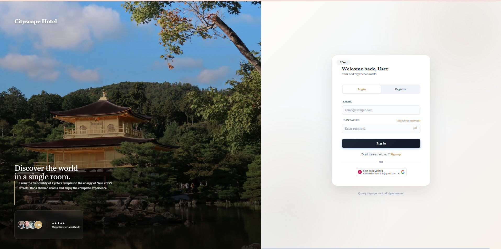
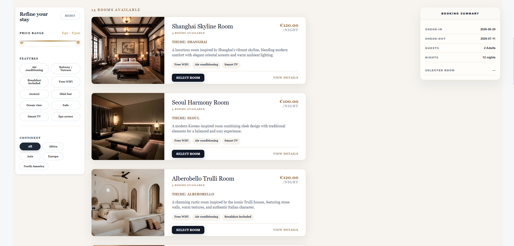
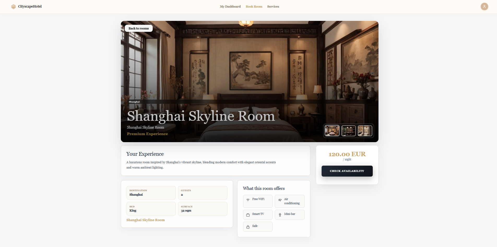
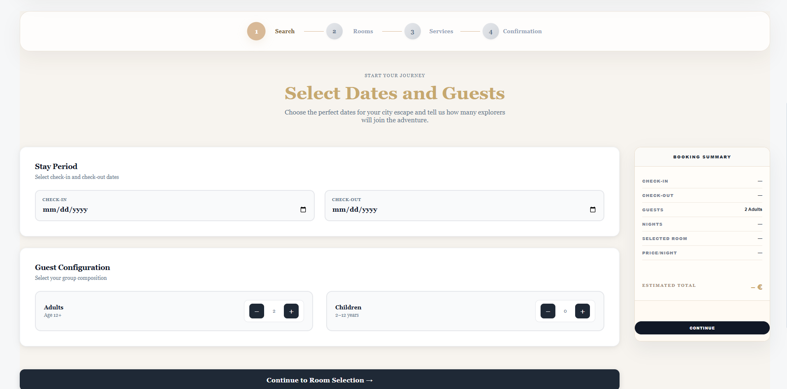
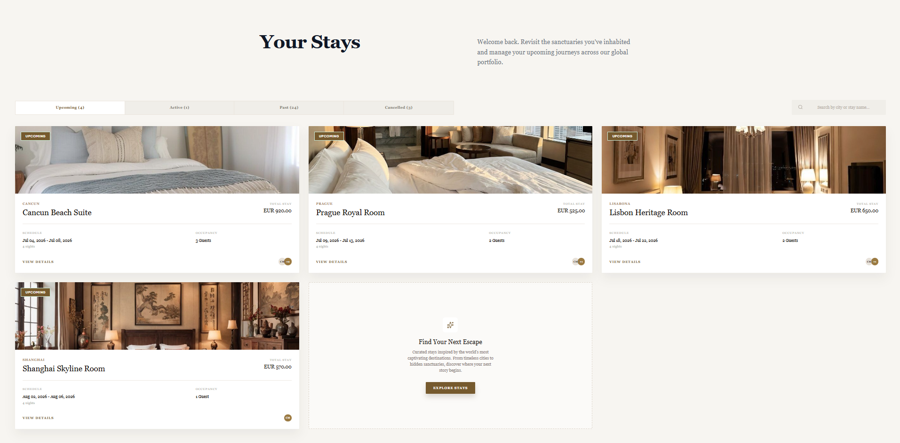
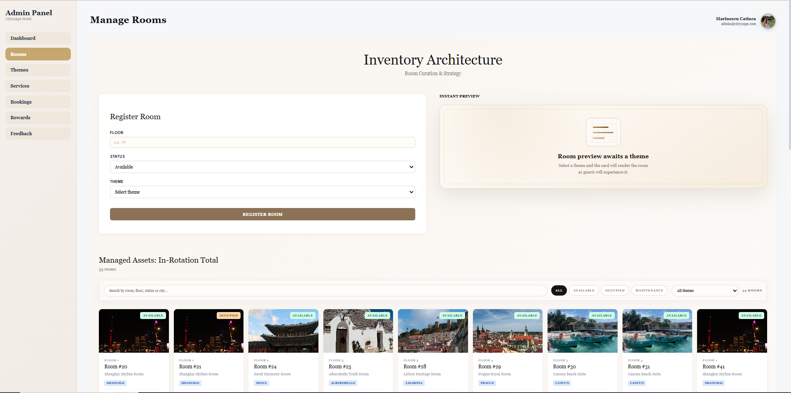
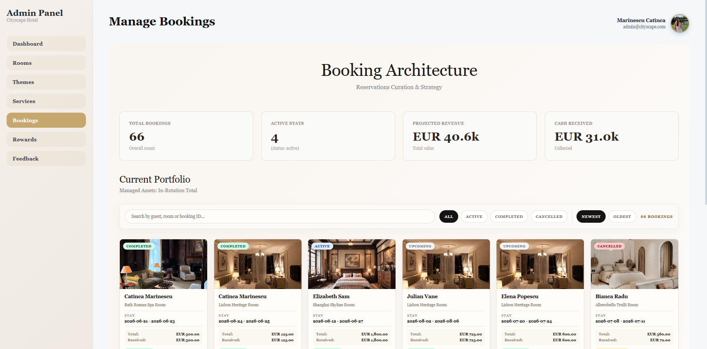
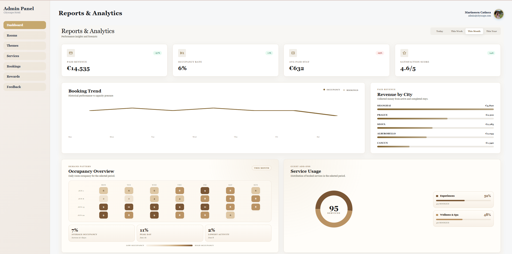
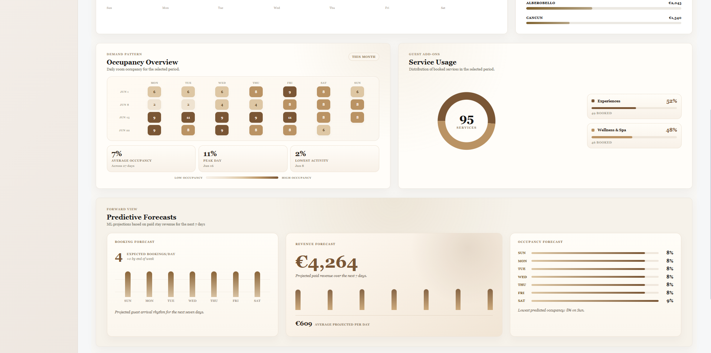

# Cityscape Hotel

**Cityscape Hotel** is a full-stack hotel booking and management platform designed for both guests and hotel administrators.

The application allows users to browse hotel rooms, create and manage bookings, while the admin side provides tools for managing rooms, services, customers, reports, and machine-learning-based forecasts.

The project simulates a realistic digital experience for a modern hotel, combining a clean user interface with practical booking and management features.

---

## Live Demo

 **Website:** https://cityscape-hotel-2lr8.vercel.app

---

##  Demo Access

You can test the guest experience using the demo account:

```txt
Email: demo@cityscape.com
Password: Demo1234
```

The demo account can be used to explore the platform, browse rooms, create bookings, manage reservations, and test the main user features.

---

##  Project Overview

Cityscape Hotel was created as a complete digital solution for a hotel business.

The platform includes two main perspectives:

- a **guest-facing website**, where users can explore rooms and make reservations;
- an **admin dashboard**, where hotel staff can manage the hotel’s activity.

The main purpose of the project is to demonstrate how a full-stack web application can support both customer interaction and business administration.

The application is not only focused on the visual side of a hotel website, but also on the functional side of managing reservations, rooms, services, customer data, reports, and forecasts.

---

##  Application Preview

### Homepage

The homepage introduces the hotel through a clean and modern interface. It is designed to create a strong first impression and guide users toward exploring rooms and booking their stay.



---

### Rooms Page

Guests can browse available rooms, view room details, compare options, and choose the room that best fits their stay.



The rooms page is one of the most important parts of the guest experience because it helps users quickly understand the available options, prices, and features.

---

### Room Details

Each room includes relevant information that helps users make a decision before creating a booking.



This section improves the booking experience by making the platform feel closer to a real hotel website.

---

### Booking Experience

The booking flow allows users to select dates, create reservations, and manage their stay in a simple and intuitive way.



The application also includes logic for suggesting alternative booking dates when the selected period is not available, making the experience more realistic and useful for the customer.

---

### Guest Dashboard

After logging in, guests can access their personal reservations and manage their bookings.



This section gives users control over their booking history and simulates a real customer account experience.

---

##  Admin Dashboard

The platform also includes a dedicated admin dashboard designed for hotel owners and staff members.

Through the admin interface, the administrator can manage rooms, services, customer data, bookings, reports, and machine-learning-based forecasts.

For security reasons, admin credentials are not included publicly in this repository.


---

### Room Management

Administrators can add, edit, and manage hotel rooms directly from the dashboard.



This feature makes the platform more realistic because the hotel offer can be updated from the owner-side interface.

---

### Customer Data

The admin dashboard includes a section for customer-related information, helping hotel staff better understand users and reservations.



This feature supports the operational side of the platform and adds more depth to the hotel management experience.

---

### Reports and Statistics

Cityscape Hotel includes reports and statistics that help the administrator understand the platform’s activity.



These insights transform the project from a simple booking website into a more complete hotel management system.

---

##  Machine Learning Forecasts

One of the most important features of the project is the integration of a machine learning service for forecasting.



The forecasting component is used on the admin side to provide data-driven insights about hotel activity.

This can help the hotel owner better understand future demand and support decisions related to bookings, availability, and business planning.

---

##  Guest User Flow

```txt
Visit website
   ↓
Create account or log in
   ↓
Browse rooms
   ↓
Select booking dates
   ↓
Create reservation
   ↓
View or manage bookings
```

The guest flow was designed to be clear, simple, and familiar, similar to real hotel booking platforms.

---

##  Admin User Flow

```txt
Log in as admin
   ↓
Access admin dashboard
   ↓
Manage rooms and services
   ↓
View bookings and customer data
   ↓
Analyze reports
   ↓
Check forecasts
```

The admin side gives the application a more complete structure, showing both the customer perspective and the hotel owner perspective.

---

##  Main Features

### Guest Features

- User authentication
- Guest demo account
- Room browsing
- Room details
- Booking creation
- Booking management
- Alternative booking date suggestions
- Personal reservation overview
- Clean and responsive interface

### Admin Features

- Admin dashboard
- Room management
- Service management
- Customer data overview
- Booking monitoring
- Reports and statistics
- Machine-learning-based forecasts
- Owner-oriented platform view

---

##  Tech Stack

### Frontend

- React
- JavaScript
- CSS
- Responsive design

### Backend

- Node.js
- Express.js
- REST API architecture

### Database

- Database structure for users, rooms, reservations, services, reports, and hotel activity

### Machine Learning Service

- Forecasting service integrated into the admin dashboard
- Used to support hotel activity analysis

### Deployment

- Vercel
- GitHub

---

##  Project Structure

```txt
cityscape-hotel/
│
├── backend/
│   └── Server-side logic, API routes and business logic
│
├── frontend/
│   └── Client-side application and user interface
│
├── ml-service/
│   └── Forecasting and machine learning functionality
│
├── docs/
│   └── Documentation, diagrams and screenshots
│
├── DATABASE_SCHEMA.md
├── DEPLOYMENT.md
├── package.json
└── README.md
```

---

##  How to Test the Platform

1. Open the live website:

```txt
https://cityscape-hotel-2lr8.vercel.app
```

2. Log in using the demo guest account:

```txt
Email: demo@cityscape.com
Password: Demo1234
```

3. Explore the guest experience:

- Browse rooms
- View room details
- Create a booking
- Manage reservations
- Test the customer-side flow

The admin dashboard is also implemented, but access credentials are not publicly shared for security reasons.

---

##  Purpose of the Project

The purpose of Cityscape Hotel is to demonstrate how a full-stack web application can support both customer interaction and business administration.

The project combines several important areas of web development:

- Frontend design
- Backend development
- Database organization
- Authentication
- Admin management
- Data reporting
- Machine learning integration
- Deployment

By including both a guest interface and an admin interface, the project offers a more complete view of how a real hotel platform could function.

---

##  Future Improvements

Possible future improvements include:

- Online payment integration
- Email booking confirmations
- Calendar-based availability view
- More advanced room filters
- Multi-language support
- Review and rating system
- More advanced forecasting models
- Improved admin analytics
- Notification system
- Better customer profile management

---

##  Author

Created by **Catinca Marinescu**.

Cityscape Hotel was developed as a full-stack hotel booking and management platform, combining a modern guest experience with practical admin tools and machine-learning-based forecasting.
